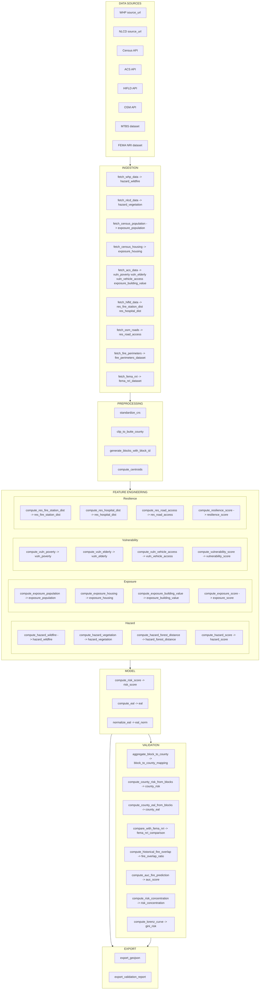

```mermaid
flowchart TD

subgraph DS[DATA SOURCES]
    A[WHP source_url]
    B[NLCD source_url]
    C[Census API]
    D[ACS API]
    E[HIFLD API]
    F[OSM API]
    G[MTBS dataset]
    H[FEMA NRI dataset]
end

subgraph ING[INGESTION]
    I1[fetch_whp_data -> hazard_wildfire]
    I2[fetch_nlcd_data -> hazard_vegetation]
    I3[fetch_census_population -> exposure_population]
    I4[fetch_census_housing -> exposure_housing]
    I5[fetch_acs_data -> vuln_poverty vuln_elderly vuln_vehicle_access exposure_building_value]
    I6[fetch_hifld_data -> res_fire_station_dist res_hospital_dist]
    I7[fetch_osm_roads -> res_road_access]
    I8[fetch_fire_perimeters -> fire_perimeters_dataset]
    I9[fetch_fema_nri -> fema_nri_dataset]
end

DS --> ING

subgraph PRE[PREPROCESSING]
    J1[standardize_crs]
    J2[clip_to_butte_county]
    J3[generate_blocks_with_block_id]
    J4[compute_centroids]
end

ING --> PRE

subgraph FE[FEATURE ENGINEERING]

    subgraph HZ[Hazard]
        H1[compute_hazard_wildfire -> hazard_wildfire]
        H2[compute_hazard_vegetation -> hazard_vegetation]
        H3[compute_hazard_forest_distance -> hazard_forest_distance]
        H4[compute_hazard_score -> hazard_score]
    end

    subgraph EX[Exposure]
        E1[compute_exposure_population -> exposure_population]
        E2[compute_exposure_housing -> exposure_housing]
        E3[compute_exposure_building_value -> exposure_building_value]
        E4[compute_exposure_score -> exposure_score]
    end

    subgraph VL[Vulnerability]
        V1[compute_vuln_poverty -> vuln_poverty]
        V2[compute_vuln_elderly -> vuln_elderly]
        V3[compute_vuln_vehicle_access -> vuln_vehicle_access]
        V4[compute_vulnerability_score -> vulnerability_score]
    end

    subgraph RS[Resilience]
        R1[compute_res_fire_station_dist -> res_fire_station_dist]
        R2[compute_res_hospital_dist -> res_hospital_dist]
        R3[compute_res_road_access -> res_road_access]
        R4[compute_resilience_score -> resilience_score]
    end

end

PRE --> FE

subgraph MODEL[MODEL]
    M1[compute_risk_score -> risk_score]
    M2[compute_eal -> eal]
    M3[normalize_eal -> eal_norm]
end

FE --> MODEL

subgraph VAL[VALIDATION]
    VLD1[aggregate_block_to_county -> block_to_county_mapping]
    VLD2[compute_county_risk_from_blocks -> county_risk]
    VLD3[compute_county_eal_from_blocks -> county_eal]
    VLD4[compare_with_fema_nri -> fema_nri_comparison]
    VLD5[compute_historical_fire_overlap -> fire_overlap_ratio]
    VLD6[compute_auc_fire_prediction -> auc_score]
    VLD7[compute_risk_concentration -> risk_concentration]
    VLD8[compute_lorenz_curve -> gini_risk]
end

MODEL --> VAL

subgraph EXP[EXPORT]
    X1[export_geojson]
    X2[export_validation_report]
end

MODEL --> EXP
VAL --> EXP
```
