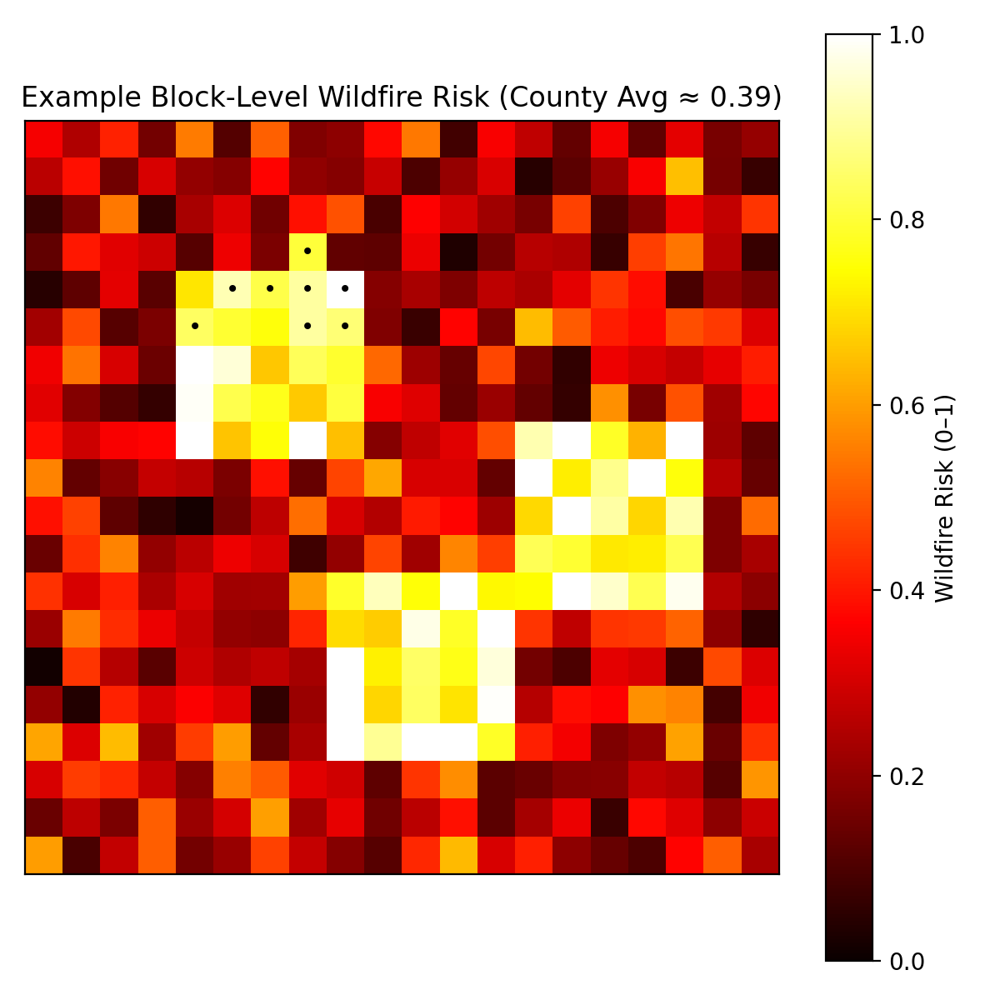

# TEAM-155:   Wildfire Risk Mapping in the United States
## Phoenix Gray, Andrei Arion, Thomas Link, Celine Phan, Daisy Than, Pradeep Singh

#  Abstract & Background
Wildfires are among the most destructive hazards in the United States. Current national risk systems, including the FEMA National Risk Index (NRI), generally report wildfire risk at **county scale**.

This proposal introduces a **block‑level wildfire risk framework** that integrates wildfire hazard, exposure of people and buildings, community vulnerability, and emergency response capacity. The model follows the structure used in national risk systems but applies it at **census block resolution**, the smallest geographic unit in the U.S. Census. Since there are 3000+ counties vs 8 million+  census blocks (blocks) in USA, county averages can hide neighborhoods with much higher wildfire danger.

The approach will show that **wildfire risk varies greatly within counties**. Some blocks face much higher wildfire danger than county averages suggest. The work builds on research showing that wildfire impacts depend on both **local landscape conditions and social vulnerability** (Moritz et al., 2014; Cutter et al., 2003).

The main contribution is a **reproducible national framework for neighborhood-scale wildfire risk assessment**.

---

# 4. Novelty of the Proposed Research

This project introduces three ideas together:

1. wildfire risk estimated at **census block level nationwide**
2. integration of **hazard, exposure, vulnerability, and resilience**
3. direct comparison between **block-level and county-level risk**

The novelty is showing that **county wildfire risk can hide dangerous local hotspots**.

This proposal has several strengths.

1. It uses **national public datasets**, making the method reproducible.
2. It combines **wildfire science with social vulnerability research**.
3. It demonstrates improvement through **direct comparison between county and block risk estimates**.

Most importantly, it addresses a key gap in existing research: the absence of **neighborhood-scale wildfire risk assessment across the United States**.

---

# Example Study Area

**Butte County, California**

Reasons:

* wildfire-prone Sierra foothills
* mix of forest and residential areas
* site of the **2018 Camp Fire**

This area allows comparison between:

county wildfire risk
neighborhood wildfire risk

---

## Current practice & limitations
Existing wildfire risk research has three major limitations:

• **Wildfire hazard studies focus on fire behavior rather than community risk**, ignoring exposure, vulnerability, and resilience (1)(3).  
• **National disaster risk frameworks evaluate wildfire risk but report results mainly at county scale**, which hides local variation inside counties (6).  
• **Fine‑scale studies show vulnerability differences at census block scale**, but they do not compute wildfire risk itself (2).

These gaps suggest the need for a **national block‑level wildfire risk framework**.

| Study                              | Geographic Scope        | Spatial Resolution        | Includes Hazard | Includes Exposure | Includes Vulnerability | Includes Resilience | Direct County vs Block Comparison | Limitation Relative to Proposed Study                                                                                    |
| ---------------------------------- | ----------------------- | ------------------------- | --------------- | ----------------- | ---------------------- | ------------------- | --------------------------------- | ------------------------------------------------------------------------------------------------------------------------ |
| **Proposed study**                 | **United States**       | **Census block**          | **Yes**         | **Yes**           | **Yes**                | **Yes**             | **Yes**                           | **none; this is the proposed contribution that integrates all components and directly tests what county averages hide.** |
| **(1)** Moritz et al. 2014         | Global / conceptual     | Regional                  | Yes             | No                | No                     | No                  | No                                | Explains wildfire–landscape interaction well, but does not build a neighborhood-scale community risk model.              |
| **(3)** Abatzoglou & Williams 2016 | Western United States   | Regional climate scale    | Yes             | No                | No                     | No                  | No                                | Shows climate drivers of wildfire, but does not estimate block-level exposure, vulnerability, or resilience.             |
| **(4)** Cutter et al. 2003         | United States           | County / regional         | No              | No                | Yes                    | No                  | No                                | Foundational vulnerability study, but it is not wildfire-specific and does not include hazard or exposure.               |
| **(2)** Yarveysi et al. 2023       | United States           | **Block level**           | No              | No                | Yes                    | No                  | No                                | Strong proof that block-level vulnerability matters, but it does not compute wildfire risk.                              |
| **(6)** FEMA National Risk Index   | United States           | County / tract            | Yes             | Yes               | Yes                    | Yes                 | No                                | Full national risk framework, but public results are too coarse to reveal neighborhood wildfire hotspots.                |
| **(5)** Kreibich et al. 2014       | General natural hazards | Not tied to one geography | Indirectly      | Indirectly        | Indirectly             | Indirectly          | No                                | Emphasizes better loss estimation, but does not provide a block-level wildfire framework.                                |

## Why County Averaging Hides Wildfire Risk

As demonstrated by the following illustration, the **county‑level average of 0.39 conceal neighborhood‑scale wildfire danger**.

#  Objective

The objective is to identify **which neighborhoods face the greatest wildfire risk**.

Wildfire danger varies across short distances because vegetation, housing density, and road access differ from one neighborhood to another. Estimating wildfire risk at **census block scale** allows identification of **local wildfire hotspots that county averages hide**.

## Who Cares?
* **Local Governments & Emergency Planners** – Need neighborhood-level risk maps to plan evacuations, fuel reduction, and fire station placement; county averages hide which communities face the highest danger.

* **Residents & Homeowners** – Wildfire risk can vary widely between nearby neighborhoods; block-level risk helps households understand their real exposure and prepare accordingly.

* **State & Federal Agencies** – Disaster mitigation funding is often allocated using risk assessments; block-level risk helps ensure funds reach the communities that face the greatest wildfire danger.

* **Insurance & Financial Sector** – More precise location-based wildfire risk improves loss modeling, insurance pricing, and financial risk assessment.

* **Researchers & Policymakers** – As wildfire risk increases with climate change, block-level analysis provides a better way to monitor impacts and evaluate mitigation policies.

##  Novelty Statement

Existing wildfire research provides hazard models, vulnerability maps, or county‑scale risk systems. However, **no study combines hazard, exposure, vulnerability, and resilience at census block scale across the United States and directly evaluates how county‑level wildfire risk masks neighborhood hotspots**.

This study therefore provides the **first reproducible block‑level wildfire risk framework compatible with national risk systems**.

#  Proposed Methodology
We propose to calculate Wildfire risk at a 'granular' **block level** using the same below approach as FEMA uses for NRI calculation at a 'coarse' **county level**.

Wildfire risk is estimated using a common disaster risk framework:

**Risk = (Hazard × Exposure × Vulnerability) / Resilience**

Where

Hazard → wildfire probability  
Exposure → population and buildings  
Vulnerability → socioeconomic sensitivity  
Resilience → ability to respond and recover

This structure is consistent with national frameworks such as FEMA’s NRI (6).

##  Table-1: Metrics Used in Risk Calculation

| Component | Variable | Contribution | Block Data Availability | Detailed Calculation Method |
|---|---|---|---|---|
Hazard | Wildfire Hazard Potential | Probability of wildfire occurrence | Available | USFS wildfire hazard raster: https://www.fs.usda.gov/rds/archive/products/RDS-2015-0047 |
Hazard | Vegetation Density | Amount of burnable fuel | Available | National Land Cover Dataset: https://www.mrlc.gov/data |
Hazard | Distance to Forest Edge | Wildland‑urban interface exposure | Derived | Compute distance from census block centroid to nearest forest polygon |
Exposure | Population | Number of people exposed | Available | Census API: https://api.census.gov/data/2020/dec/pl |
Exposure | Housing Units | Structures exposed | Available | Census housing table H1 |
Exposure | Building Value | Economic exposure | Derived | Housing units × ACS median property value |
Vulnerability | Poverty Rate | Ability to recover | Not available | Allocate block‑group poverty values using population weighting |
Vulnerability | Elderly Population | Evacuation difficulty | Not available | Allocate ACS age statistics to blocks |
Vulnerability | Vehicle Ownership | Evacuation capacity | Not available | ACS vehicle ownership data |
Resilience | Distance to Fire Station | Emergency response capacity | Derived | HIFLD dataset: https://hifld-geoplatform.opendata.arcgis.com |
Resilience | Distance to Hospital | Medical response | Derived | HIFLD hospital dataset |
Resilience | Road Access | Evacuation routes | Derived | OpenStreetMap road network via Overpass API |

##  Validation Strategy

• **Test 1 – County Risk Comparison**  Compare aggregated block risk with FEMA NRI wildfire risk values.

• **Test 2 – Expected Annual Loss Comparison**  Block EAL = wildfire probability × building exposure.  | County EAL = sum of block EAL values.

• **Test 3 – Historical Fire Validation**   Compare predicted high‑risk blocks with wildfire burn perimeters and ignition records.

• **Test 4 – Risk Concentration Analysis**   Measure how much of county wildfire risk is contained in the highest‑risk blocks.

## Risk
• Some important variables, such as income, age, or vehicle ownership, are not directly available at block level and must be estimated from larger census areas. 

• Wildfire hazard data may also differ in quality across regions, which can affect accuracy.

## Payoffs
 • The payoff is a much clearer picture of where wildfire risk is concentrated. 

 • The study can reveal high-risk neighborhoods hidden inside moderate-risk counties, improve evacuation and mitigation planning, and provide a stronger basis for funding and policy decisions.

## Cost
• The project mainly uses public datasets, so the main cost is research time, computing, and GIS/data processing. All of these should be at no cost since this project is part of CSE6242 coursework. 

# References

1. Moritz, M.A. et al. 2014. Learning to coexist with wildfire. Nature. https://www.nature.com/articles/nature13946  
2. Yarveysi, F. et al. 2023. Block‑level vulnerability assessment reveals disproportionate impacts of natural hazards. https://www.nature.com/articles/s41467-023-41888-0  
3. Abatzoglou, J.T., Williams, A.P. 2016. Impact of climate change on wildfire across western US forests. https://www.pnas.org/doi/10.1073/pnas.1607171113  
4. Cutter, S.L., Boruff, B., Shirley, W. 2003. Social vulnerability to environmental hazards. https://doi.org/10.1111/1540-6237.8402002  
5. Kreibich, H. et al. 2014. Costing natural hazards. https://www.nature.com/articles/nclimate2126  
6. FEMA National Risk Index. https://hazards.fema.gov/nri/
