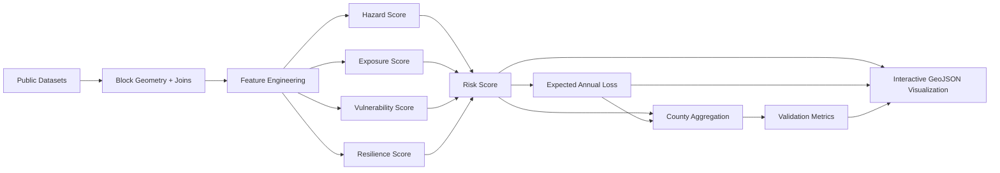
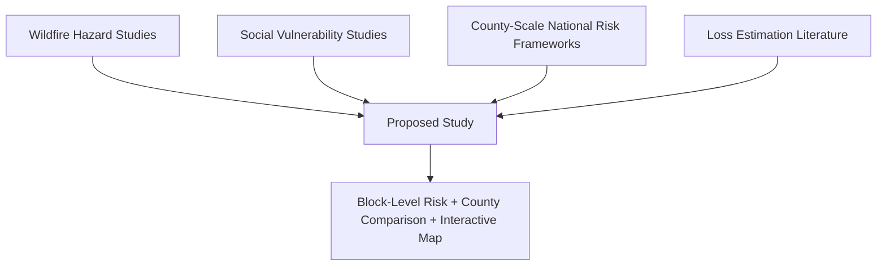
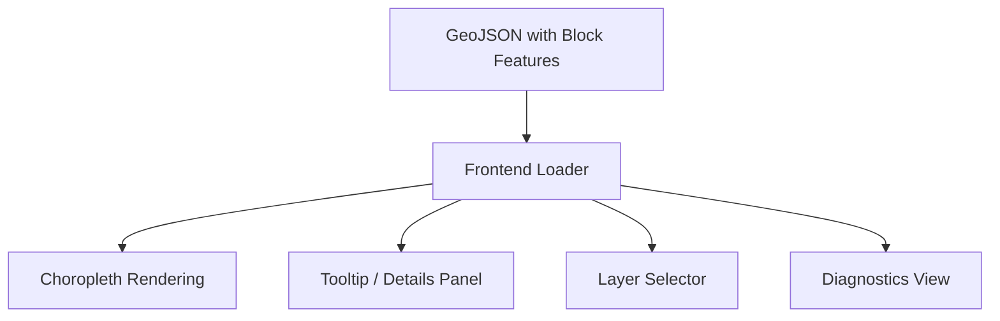

# TEAM-155: Wildfire Risk Mapping in the United States

**Team Members:** Phoenix Gray, Andrei Arion, Thomas Link, Celine Phan, Daisy Than, Pradeep Singh

---

## 1. Introduction

Wildfire risk in the United States is increasing because of the interaction between climate conditions, vegetation patterns, expanding development near wildland areas, and unequal community capacity to prepare for and recover from disasters. Although national risk products such as FEMA's National Risk Index provide useful large-scale assessments, they are primarily reported at coarse geographic resolutions such as counties. County-level summaries are helpful for broad comparison, but they often hide strong variation within counties, especially in places where forested land, road connectivity, housing patterns, and socioeconomic conditions change sharply over short distances.

This project addresses that limitation by building a neighborhood-scale wildfire risk mapping framework at **census block resolution**. Census blocks are the smallest geographic units defined by the U.S. Census Bureau, making them a suitable unit for revealing local hotspots that county averages may obscure. Two nearby blocks can face very different wildfire conditions because of differences in burnable vegetation, distance to forest edges, density of people and homes, poverty levels, age structure, vehicle access, and proximity to emergency services. A block-level system therefore provides a more actionable view of where wildfire danger is concentrated and where communities may face the greatest consequences if a fire occurs.

Our framework follows a standard disaster-risk perspective in which wildfire risk depends on four major components: **hazard, exposure, vulnerability, and resilience**. Hazard represents the likelihood or intensity of wildfire-related threat. Exposure captures the people, housing, and economic assets that could be affected. Vulnerability represents social conditions that can make evacuation, response, and recovery more difficult. Resilience represents the capacity of a community to respond and recover, including access to roads, hospitals, and fire stations. Rather than studying wildfire hazard alone, this approach models wildfire risk as a combination of physical threat and human consequence.

The project is designed as a reproducible data pipeline built from public datasets and transparent calculations. As documented in `calculations.csv`, the system computes wildfire-related features from sources including the U.S. Forest Service Wildfire Hazard Potential data, National Land Cover Database land-cover data, Census population and housing counts, ACS socioeconomic variables, HIFLD critical infrastructure layers, and OpenStreetMap road networks. These inputs are processed into standardized block-level indicators and combined into interpretable composite scores for hazard, exposure, vulnerability, resilience, overall risk, and expected annual loss. The resulting outputs are validated, exported to GeoJSON, and visualized in an interactive frontend so users can inspect risk patterns spatially.

This work is important for several audiences. Local governments and emergency planners need fine-grained maps to support evacuation planning, fuel treatment prioritization, and fire-response investment. Residents and homeowners benefit from understanding how wildfire risk differs across neighborhoods, even within the same county. Researchers and policymakers benefit from a framework that tests whether county-scale averages systematically mask concentrated neighborhood risk. More broadly, the project aligns with the course objective of integrating substantial public data, non-trivial computation, and an interactive visual interface into a complete analytical system.

The central premise of this report is that **county wildfire risk estimates can conceal important neighborhood-scale variation**. By producing a block-level wildfire risk map and comparing aggregated block results with county-scale benchmarks, this project aims to show that meaningful wildfire hotspots exist within counties and that these hotspots can be identified using a reproducible national framework.

---

## 2. Problem Definition

### 2.1 Jargon-Free Problem Statement

Current wildfire risk maps usually summarize conditions over very large areas such as counties. That makes it hard to answer a practical question: **which neighborhoods inside a county are actually in the most danger?** A county may appear to have moderate wildfire risk overall, while some of its neighborhoods may face much higher danger because they are closer to forests, have more burnable vegetation, contain more people and homes, or have weaker access to transportation and emergency response services.

The problem addressed in this project is therefore to build a system that can identify wildfire risk at a much finer scale than county averages. Specifically, the goal is to estimate wildfire risk for each **census block**, compare those block-level results with county-level summaries, and determine whether county averages hide local wildfire hotspots. The system must combine physical wildfire conditions with information about who and what is exposed, which communities are more socially vulnerable, and how well communities can respond and recover.

### 2.2 Formal Problem Definition

Let `B = {b1, b2, ..., bn}` be the set of census blocks in the study region. For each block `b ∈ B`, the pipeline computes a set of normalized component scores derived from public environmental, demographic, and infrastructure datasets:

- hazard score `H(b) ∈ [0,1]`
- exposure score `E(b) ∈ [0,1]`
- vulnerability score `V(b) ∈ [0,1]`
- resilience score `R(b) ∈ [0,1]`

Each component score is built from lower-level features defined in `calculations.csv` and implemented in the project pipeline:

- `H(b)` from wildfire probability, vegetation/fuel proxy, and distance to forest
- `E(b)` from population, housing units, and estimated building value
- `V(b)` from poverty, elderly population share, and vehicle access proxy
- `R(b)` from distance to fire stations, distance to hospitals, and road access

The implemented wildfire risk model is:

**Risk(b) = H(b) × E(b) × V(b) × (1 − R(b))**

where `R(b)` is defined so that larger values indicate stronger resilience. This implemented form is consistent with the project’s bounded `0–1` scoring scheme in `calculations.csv`; it behaves like a resilience-adjusted risk model in which stronger response and recovery capacity reduces final risk.

The project also computes expected annual loss:

**EAL(b) = Risk(b) × BuildingValue(b)**

where `BuildingValue(b)` is approximated from housing units and ACS median property value at the block-group level.

Let `C = {c1, c2, ..., cm}` be the set of counties intersecting the study region. For each county `c`, block-level outputs are aggregated to county-scale validation measures such as:

- `CountyRisk(c) = mean(Risk(b))` for blocks within `c`
- `CountyEAL(c) = sum(EAL(b))` for blocks within `c`

The computational problem is to design and evaluate a reproducible mapping `f : B → [0,1]` such that:

1. `f(b)` identifies meaningful block-level variation in wildfire risk;
2. aggregated block outputs are comparable to external county-level reference systems such as FEMA NRI;
3. high-risk blocks align better with historical fire outcomes than coarse county averages alone; and
4. the results can be visualized interactively for exploration and interpretation.

### 2.3 Research Questions

This project is organized around the following questions:

1. **How much wildfire risk variation exists within counties when measured at census block resolution?**
2. **Do county-scale averages hide high-risk neighborhoods that become visible at block scale?**
3. **Can a block-level framework that combines hazard, exposure, vulnerability, and resilience produce plausible risk patterns when compared with FEMA NRI and historical fire data?**
4. **Can the outputs be packaged into a reproducible pipeline and interactive visual tool useful for analysis and decision support?**

### 2.4 System Flow Diagram

**Figure Placeholder 1.** County-level wildfire choropleth versus block-level hotspot map, showing how a moderate county average can hide highly exposed neighborhoods. Insert final visualization screenshot here.

### 2.5 Input-Output Specification

| Element | Definition | Spatial Unit | Output Type |
| --- | --- | --- | --- |
| Input geometry | Census blocks or project block geometries | Block | GeoDataFrame |
| Hazard inputs | WHP, NLCD, forest distance | Block or raster-to-block | Numeric features |
| Exposure inputs | Population, housing, building value estimate | Block / block-group joined to block | Numeric features |
| Vulnerability inputs | Poverty, elderly, vehicle access | Block-group allocated to block | Numeric features |
| Resilience inputs | Fire stations, hospitals, road access | Block | Numeric features |
| Primary output | `risk_score` | Block | Float in `[0,1]` |
| Economic output | `eal`, `eal_norm` | Block | Float |
| Validation outputs | county aggregates, FEMA comparison, fire overlap, AUC, Gini | County / global / attached to blocks | Metrics + diagnostics |
| Visualization output | GeoJSON fields consumed by frontend | Block | Interactive map layer |

### 2.6 Variables Used in the Implemented Model

Table 1 summarizes the core variables from `calculations.csv` used directly in the implemented pipeline.

| Component | Implemented Variable | Description | Source |
| --- | --- | --- | --- |
| Hazard | `hazard_wildfire` | Mean wildfire hazard potential in block | USFS WHP |
| Hazard | `hazard_vegetation` | Fuel-density proxy from land cover | NLCD |
| Hazard | `hazard_forest_distance` | Inverted distance to forest | NLCD / derived |
| Exposure | `exposure_population` | Population count | Census PL |
| Exposure | `exposure_housing` | Housing unit count | Census H1 |
| Exposure | `exposure_building_value` | Housing units × median property value | ACS / derived |
| Vulnerability | `vuln_poverty` | Poverty proxy allocated to blocks | ACS |
| Vulnerability | `vuln_elderly` | Elderly share allocated to blocks | ACS |
| Vulnerability | `vuln_vehicle_access` | Vehicle-access proxy | ACS |
| Resilience | `res_fire_station_dist` | Access to fire stations | HIFLD / derived |
| Resilience | `res_hospital_dist` | Access to hospitals | HIFLD / derived |
| Resilience | `res_road_access` | Road connectivity proxy | OSM / derived |
| Model | `risk_score` | Composite wildfire risk | Derived |
| Model | `eal` | Expected annual loss estimate | Derived |

### 2.7 Why This Problem Is Non-Trivial

This is not a simple mapping task. The system requires combining multiple heterogeneous public datasets with different geographic units, formats, and semantics. Some features are raster-based, some come from APIs, some require nearest-neighbor spatial computation, and some are only available at coarser levels such as census block groups and must therefore be allocated downward to blocks. The project also requires normalization, provenance tracking, diagnostics, fallback logic for missing data, validation metrics, and an interactive frontend that exposes the results. Together, these steps satisfy the course requirement for large public data, non-trivial computation, and interactive visualization.

---

## 3. Literature Survey

The literature motivating this project spans wildfire science, disaster risk modeling, social vulnerability, and natural-hazard loss estimation. Existing work provides strong foundations for the project’s four main components, but the review also shows a consistent gap: the lack of a reproducible, publicly documented **block-level wildfire risk framework** that integrates hazard, exposure, vulnerability, and resilience while also comparing block outputs against county-scale systems.

### 3.1 Wildfire Hazard and Landscape Context

Moritz et al. (2014) argue that societies must learn to coexist with wildfire rather than treat it only as a controllable disturbance. Their central contribution is conceptual: wildfire emerges from interaction among climate, fuels, human settlement patterns, and governance. This paper is useful because it frames wildfire as a coupled human-natural systems problem rather than a purely biophysical hazard. That framing directly supports our decision to move beyond hazard-only mapping and include exposure, vulnerability, and resilience. Its limitation, however, is that it does not provide an operational fine-scale computational framework for neighborhood-level risk estimation.

Abatzoglou and Williams (2016) quantify the climatic drivers behind increased wildfire activity in western U.S. forests. Their work is valuable because it establishes that wildfire hazard is strongly associated with large-scale environmental conditions and that future wildfire risk is likely to intensify under climate change. For this project, the paper strengthens the motivation for hazard inputs such as wildfire hazard potential and vegetation-based fuel proxies. Its limitation is that it focuses on climatic explanation at broad regional scales rather than localized community risk or spatially explicit social consequences.

The project also draws practical inspiration from wildfire hazard products such as the U.S. Forest Service Wildfire Hazard Potential surface, which operationalizes broad wildfire likelihood into a spatial product usable for block-level zonal summaries. These hazard products are strong inputs, but by themselves they are insufficient for community risk because they do not measure the people, assets, or capacities that determine consequence.

### 3.2 Social Vulnerability and Unequal Consequences

Cutter, Boruff, and Shirley (2003) provide one of the foundational social-vulnerability frameworks for environmental hazards in the United States. Their contribution is to show that hazard impacts depend not only on physical exposure but also on socioeconomic characteristics such as poverty, age, housing quality, and mobility constraints. This study is highly useful for our project because it justifies including vulnerability variables alongside wildfire hazard. In particular, our block-level measures for poverty, elderly population, and vehicle access closely reflect the kinds of social factors emphasized in the vulnerability literature. A limitation is that Cutter et al. is not wildfire-specific and does not itself define a wildfire risk model.

Yarveysi et al. (2023) are especially relevant because they show that block-level analysis can reveal disproportionate natural-hazard burdens hidden by coarser spatial aggregation. Their work provides strong evidence that social vulnerability can vary sharply within counties and that fine spatial resolution matters for equity-sensitive risk assessment. This is directly aligned with the central argument of our project: county-level reporting can mask neighborhood-scale differences. The limitation, from our perspective, is that the study focuses primarily on vulnerability rather than a full wildfire risk model integrating hazard, exposure, and resilience.

### 3.3 Risk Frameworks and Economic Loss

The FEMA National Risk Index is the most directly relevant national risk framework for this project because it combines hazard, exposure, vulnerability, and community resilience into a unified public risk product. It demonstrates that multi-factor hazard risk systems are feasible at national scale and provides an external benchmark for validation. This project is intentionally compatible with that general structure, but differs in a major way: public NRI outputs are primarily communicated at county or tract scale, whereas our framework pushes the computation and visualization down to census blocks. The NRI is therefore useful both as a methodological reference and as a validation target. Its key limitation for our research question is its spatial coarseness for neighborhood hotspot detection.

Kreibich et al. (2014) emphasize the importance of more rigorous natural-hazard loss estimation and the distinction between hazard occurrence and realized damage. Their discussion is relevant because our project computes an economic consequence measure, expected annual loss (`eal`), by combining risk with estimated building value. This paper supports the argument that loss-based views of disaster impacts are necessary for practical planning and resource allocation. Its limitation is that it is not a block-level wildfire framework and does not address the geospatial allocation issues involved in moving from broad hazard concepts to neighborhood-scale estimates.

### 3.4 Where Existing Work Falls Short

The literature reveals an important pattern.

1. Wildfire science papers explain **where fires are likely** and why hazard is increasing.
2. Vulnerability research explains **which people are likely to suffer more**.
3. National risk systems demonstrate how to combine multiple components at broad scale.
4. But no single source in our reviewed set provides a reproducible, public, **block-level wildfire risk implementation** that integrates all four dimensions and directly tests whether county averages hide local hotspots.

That gap is the main motivation for this project.

### 3.5 Literature Comparison Table

Table 2 positions the proposed study against the most relevant prior work.

| Study | Main Idea | Useful for This Project | Key Limitation Relative to This Work |
| --- | --- | --- | --- |
| Moritz et al. (2014) | Wildfire is a coupled human-natural systems problem | Motivates integrating environmental and community factors | Conceptual and broad-scale; no block-level computational model |
| Abatzoglou & Williams (2016) | Climate change has increased wildfire conditions in western U.S. forests | Supports hazard motivation and environmental component design | Hazard-focused; no exposure, vulnerability, or resilience model |
| Cutter et al. (2003) | Social vulnerability shapes hazard consequences | Justifies poverty, age, and mobility variables | Not wildfire-specific and not a complete risk framework |
| Yarveysi et al. (2023) | Block-level vulnerability reveals hidden unequal risk | Strong evidence that fine spatial resolution matters | Focuses on vulnerability, not integrated wildfire risk |
| FEMA National Risk Index | National risk framework combining multiple dimensions | Reference architecture and county-level validation target | Public outputs too coarse to reveal block-scale wildfire hotspots |
| Kreibich et al. (2014) | Hazard studies should better account for economic loss | Motivates `eal` as an applied outcome measure | Not a wildfire-specific, neighborhood-scale mapping framework |

### 3.6 Implications for the Proposed Approach

The literature directly shaped the design of the implemented pipeline.

- From wildfire science, we adopt the view that hazard is necessary but not sufficient.
- From social vulnerability research, we incorporate demographic and socioeconomic disadvantage as a core part of risk.
- From national risk systems, we adopt a structured decomposition into hazard, exposure, vulnerability, and resilience.
- From hazard-loss research, we include an economic loss estimate rather than only a bounded risk score.
- From fine-scale vulnerability studies, we treat spatial resolution itself as a substantive research choice rather than a mere implementation detail.

In short, the literature suggests that the proposed method should outperform county-only interpretations not necessarily because county models are wrong, but because they are too spatially aggregated to reveal neighborhood concentration of wildfire danger.

### 3.7 Visual Placement of the Literature Gap

**Figure Placeholder 2.** Literature positioning diagram or concept graphic showing how the project bridges hazard science, social vulnerability, resilience, and national risk frameworks. Insert final figure or poster-quality diagram here.

### 3.8 Summary of the Literature Gap

The strongest conclusion from the literature is that **the ingredients for a neighborhood-scale wildfire risk framework already exist in separate strands of prior work, but they have not been combined in a single reproducible block-level implementation for this problem**. That is the niche filled by this project. The contribution is not only a new visualization, nor only a new hazard layer, but a full analytical pipeline that integrates multiple public datasets, computes block-level wildfire risk and loss metrics, validates them against county-scale references, and exposes the results in an interactive spatial interface.

---

## 4. Proposed Method

### 4.1 Intuition

The intuition behind the proposed method is simple: a place should be considered high wildfire risk only when several conditions occur together. A block should score high if wildfire hazard is high, if many people or valuable structures are exposed, if social conditions make response and recovery harder, and if local resilience is weak. A hazard-only model misses human consequence; a vulnerability-only model misses the actual fire environment; and a county-average model smooths away meaningful local differences. By computing all of these components at block scale, the method should reveal clusters of concentrated wildfire danger that are invisible in county summaries.

This structure is also expected to outperform coarse risk interpretations in a practical sense. Two blocks may lie in the same county and share the same county wildfire label, yet differ sharply in forest proximity, housing density, poverty, vehicle ownership, and emergency access. Our approach preserves those local contrasts. The expected benefit is therefore not that the model invents new wildfire physics, but that it combines known environmental and social signals at a more decision-relevant spatial scale.

### 4.2 Overall Pipeline Architecture

The implemented method is a modular pipeline that ingests public datasets, derives standardized block-level features, computes composite scores, validates the results, and exports them for visualization. The pipeline uses `calculations.csv` as the canonical feature contract, meaning each implemented metric is associated with a data source, transformation rule, validation range, and output field.

**Figure Placeholder 3.** End-to-end pipeline diagram using actual file names and modules from the implementation. Insert a refined exported diagram here.

### 4.3 Data Sources and Spatial Integration

The pipeline combines several public datasets with different spatial formats:

| Data Source | Example Variables Used | Native Format | Role in Method |
| --- | --- | --- | --- |
| USFS Wildfire Hazard Potential | `hazard_wildfire` | Raster | Hazard likelihood proxy |
| NLCD | `hazard_vegetation`, forest-distance inputs | Raster / derived polygons | Fuel and forest proximity |
| Census PL / H1 | population, housing | API / tabular | Exposure |
| ACS 5-year | property value, poverty, age, vehicle access | API / tabular | Exposure + vulnerability |
| HIFLD | fire stations, hospitals | Point layers | Resilience |
| OpenStreetMap / Overpass | road network | Vector line data | Resilience |
| FEMA NRI | county-scale reference metrics | Tabular | Validation |
| MTBS fire perimeters | burned-area history | Polygon layer | Validation |

Because these datasets are not aligned to the same geography, the method performs several joins and transformations:

1. raster-to-block zonal statistics for wildfire and vegetation features;
2. nearest-neighbor distance calculations from block centroids to infrastructure or forest features;
3. joins from block-group ACS data down to blocks using geographic keys and population-based allocation;
4. area- or density-based transformations for road access and land-cover proxies; and
5. final export of all derived block-level outputs to a single GeoJSON layer.

### 4.4 Feature Engineering by Component

#### 4.4.1 Hazard

The hazard component captures the underlying wildfire threat from vegetation and landscape conditions.

- **Wildfire Hazard Potential (`hazard_wildfire`)** is computed as the mean WHP value of raster pixels intersecting each block.
- **Vegetation/Fuel Proxy (`hazard_vegetation`)** is derived from NLCD by classifying relevant fuel-supporting land-cover classes such as forest or shrub and measuring their share within the block.
- **Forest Proximity (`hazard_forest_distance`)** is computed as an inverted nearest distance from block centroid to forest features, using the form `1 / (1 + distance_km)`.

These features are normalized to `[0,1]` and combined using configurable weights:

**HazardScore = w1·hazard_wildfire + w2·hazard_vegetation + w3·hazard_forest_distance**

This construction is intended to capture both direct wildfire likelihood and a wildland-urban interface effect.

#### 4.4.2 Exposure

The exposure component measures how much population, housing, and economic value are located in each block.

- **Population (`exposure_population`)** comes from Census PL block counts.
- **Housing Units (`exposure_housing`)** come from Census H1.
- **Building Value (`exposure_building_value`)** is approximated as housing units multiplied by ACS block-group median property value, joined to blocks.

The exposure component is then formed as a normalized combination:

**ExposureScore = norm(population) + norm(housing) + norm(building_value)**

or, in implementation terms, a weighted normalized sum with bounded output. This allows the model to capture both human and economic consequence.

#### 4.4.3 Vulnerability

The vulnerability component captures social conditions that may worsen wildfire consequence even when physical exposure is similar.

- **Poverty (`vuln_poverty`)** is derived from ACS poverty counts/rates at block-group scale and allocated to blocks using population-based weighting.
- **Elderly Population (`vuln_elderly`)** is derived similarly from ACS age tables.
- **Vehicle Access (`vuln_vehicle_access`)** uses ACS vehicle-ownership statistics as a mobility and evacuation proxy.

The implementation combines normalized vulnerability features through a weighted sum:

**VulnerabilityScore = w1·vuln_poverty + w2·vuln_elderly + w3·vuln_vehicle_access**

This structure is motivated by the literature showing that age, poverty, and transportation constraints strongly affect disaster response and recovery.

#### 4.4.4 Resilience

The resilience component measures community access to emergency services and evacuation-supporting infrastructure.

- **Fire Station Access (`res_fire_station_dist`)** is computed from nearest distance to HIFLD fire stations and transformed by inversion.
- **Hospital Access (`res_hospital_dist`)** is computed analogously for HIFLD hospitals.
- **Road Access (`res_road_access`)** is computed from OSM road network length relative to block area or a related road-connectivity proxy.

These features are combined by weighted normalized sum:

**ResilienceScore = w1·res_fire_station_dist + w2·res_hospital_dist + w3·res_road_access**

Higher resilience values lower final risk in the implemented model.

### 4.5 Unified Risk and Economic Model

Once the four component scores are computed, the pipeline calculates the main outputs.

#### 4.5.1 Risk Score

The core implemented equation is:

**risk_score = hazard_score × exposure_score × vulnerability_score × (1 − resilience_score)**

This formulation preserves four desirable properties:

1. risk remains bounded in `[0,1]`;
2. risk increases when any of hazard, exposure, or vulnerability increases;
3. risk decreases when resilience increases; and
4. a block with very low value in one essential component cannot dominate the system unfairly through addition alone.

The multiplicative form therefore acts as a conservative interaction model: high risk emerges when several risk-driving conditions are simultaneously elevated.

#### 4.5.2 Expected Annual Loss

To make the result more interpretable for planning, the model computes expected annual loss:

**eal = risk_score × exposure_building_value**

and then a normalized version for mapping:

**eal_norm = (eal − min(eal)) / (max(eal) − min(eal))**

This gives the system both a bounded comparative risk score and a dollar-denominated consequence estimate.

### 4.6 Provenance, Diagnostics, and Fallback Logic

A practical challenge in public-data pipelines is incomplete or missing input layers. The implementation addresses this through provenance and diagnostics columns documented in `README.md`.

- Each field may be accompanied by `_source` and `_provenance` metadata.
- Each record includes a `diagnostics` field summarizing validation issues.
- When certain optional external datasets are missing, the pipeline computes safe fallback values rather than failing completely.
- Validation rules from `calculations.csv` enforce bounds, nullability, and type expectations.

This design makes the method more robust for course demonstration and future extension. It also improves interpretability by distinguishing between real-data and fallback-data outputs.

### 4.7 Validation-Oriented Outputs

Although full evaluation is described in Section 5, the proposed method explicitly produces validation-ready outputs as part of the pipeline.

| Validation Output | Purpose |
| --- | --- |
| `block_to_county_mapping` | Aggregation from blocks to counties |
| `county_risk` | Compare aggregated block risk with county references |
| `county_eal` | Aggregate loss for county-scale comparison |
| `fema_nri_comparison` | External benchmark against FEMA NRI |
| `fire_overlap_ratio` | Historical burned-area overlap test |
| `auc_score` | Predictive discrimination of high-risk blocks |
| `risk_concentration` | Share of risk in top blocks |
| `gini_risk` | Spatial inequality of risk distribution |

This is important because the method is not only a score generator; it is built to support structured assessment of whether block-level outputs are plausible and useful.

### 4.8 Interactive Visualization Design

The frontend is a required part of the project method, not just a presentation layer. The output GeoJSON is visualized in an interactive map interface so users can inspect patterns that static county averages would hide.

The intended interface supports:

- map-based exploration of block-level `risk_score`, `eal_norm`, and component scores;
- field-driven coloring by hazard, exposure, vulnerability, resilience, risk, or loss;
- hover or click details for each block, including diagnostics and provenance;
- comparison of neighboring blocks within the same county; and
- interpretation of validation-related fields when available.

**Figure Placeholder 4.** Main interactive map interface showing wildfire risk by block with tooltip details. Insert screenshot from final visualization here.

**Figure Placeholder 5.** Alternate layer view, e.g. vulnerability or resilience, demonstrating how the interface supports component-level inspection. Insert screenshot here.

### 4.9 Why the Method Should Be Better Than the State of the Art for This Use Case

The method is expected to improve on county-level wildfire interpretation for three reasons.

1. **Higher spatial resolution.** Block-level outputs preserve local variation in fuels, population, vulnerability, and emergency access.
2. **Integrated structure.** The model captures both wildfire likelihood and human consequence, rather than reducing the problem to hazard alone.
3. **Operational reproducibility.** Every major variable is defined in `calculations.csv`, implemented in code, validated, and exported to a user-facing interface.

In other words, the novelty is not one single algorithmic trick. It is the combination of fine spatial resolution, multi-source feature integration, resilience-aware risk modeling, and direct visual comparison of neighborhood hotspots against coarse administrative summaries.

### 4.10 Implementation Summary Table

| Stage | Main Operation | Example Functions / Outputs |
| --- | --- | --- |
| Ingestion | Load raw tabular and geospatial inputs | Census, ACS, NLCD, HIFLD, OSM, FEMA, MTBS |
| Preprocessing | Clean schemas, harmonize keys, prepare geometry | block IDs, county joins, centroids |
| Feature engineering | Compute direct and derived variables | `compute_hazard_*`, `compute_exposure_*`, `compute_vuln_*`, `compute_res_*` |
| Modeling | Build component scores and final outputs | `hazard_score`, `exposure_score`, `vulnerability_score`, `resilience_score`, `risk_score`, `eal` |
| Validation | Aggregate and compare with external references | county metrics, FEMA comparison, overlap, AUC, Gini |
| Export | Write processed block GeoJSON | `data/processed/blocks.geojson` |
| Visualization | Render interactive map and panels | frontend fields from GeoJSON |

### 4.11 Method Limitations by Design

The method also makes several practical approximations.

- Some socioeconomic variables are only available at block-group scale and must be allocated to blocks.
- Building value is estimated from housing counts and median property value rather than parcel-level appraisal data.
- Road access is measured through a simple network-density proxy rather than full evacuation simulation.
- Resilience is represented through infrastructure access, not a full institutional-capacity model.

These are limitations, but they are deliberate tradeoffs that preserve national reproducibility using public data.

---

## 5. Evaluation

*To be completed.*

## 6. Conclusions and Discussion

*To be completed.*
